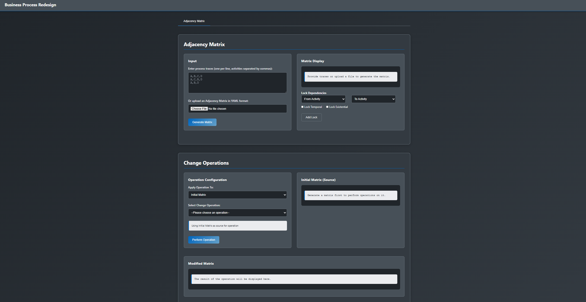

# Automated Support for Redesigning Business Process Behavior

[](https://www.python.org/downloads/)
[](https://flask.palletsprojects.com/)
[](https://opensource.org/licenses/MIT)

This project provides a web-based application for the automated redesign of business processes. It offers a modeling language-independent approach to apply behavioral change operations, addressing the challenges of manual redesign which is often labor-intensive, error-prone, and difficult to scale.

The core of the application lies in its use of **activity relations** (represented as an adjacency matrix) and **acceptance sequences** (all possible execution paths) to systematically apply changes and automatically capture all secondary behavioral effects.



A demo website can be found online at [https://practicalcourse.pythonanywhere.com/](https://practicalcourse.pythonanywhere.com/)

## Core Concepts

This tool is built on a powerful two-step process transformation approach:

1.  **Adjacency Matrix to Acceptance Sequences:** A business process, defined by pairwise activity relations in an adjacency matrix, is first translated into a complete set of its acceptance sequences. This representation enumerates all valid execution traces allowed by the process model.

2.  **Applying Change Operations:** The redesign operations are applied directly to this simple list-based representation of acceptance sequences. This simplifies complex structural changes into straightforward list manipulations.

3.  **Acceptance Sequences back to Adjacency Matrix:** The modified set of acceptance sequences is then converted back into an adjacency matrix. This final step automatically discovers and reflects all primary and secondary changes to the process's temporal and existential dependencies.

This workflow ensures that even complex, cascading changes are captured consistently and correctly, a significant advantage over manual redesign.

## Key Features

*   **Modeling Notation Independent:** By using an abstract representation (activity relations matrix), the tool can work with any process modeling language.
*   **11 Automated Change Operations:** Implements a comprehensive set of basic and composite redesign operations.
*   **Custom YAML Format:** A clean, human-readable YAML format for defining and exporting process models.
*   **Dependency Locking:** Allows users to "lock" critical dependencies, preventing them from being altered by change operations and ensuring process integrity.
*   **Side-by-Side Visualization:** The UI provides a clear "diff" view, highlighting changes between the original and modified process models.
*   **Performance Optimized:** The computationally intensive task of generating acceptance sequences has been heavily optimized with caching, bitwise operations, and backtracking algorithms, making the tool practical for real-world processes.

### Supported Change Operations

The application supports 11 distinct behavioral change operations:

**Basic Operations:**
*   **Insert:** Add a new activity to the process with specified dependencies.
*   **Remove:** Remove an existing activity from the process.
*   **Modify:** Change the temporal and/or existential dependencies between two activities.

**Composite Operations:**
*   **Move:** Move an activity to a new position.
*   **Replace:** Replace an existing activity with a new one, inheriting its dependencies.
*   **Parallelize:** Make a set of activities executable in any order (concurrently).
*   **Collapse:** Abstract a set of activities into a single sub-process activity.
*   **De-collapse:** Expand a sub-process activity back into its constituent activities.
*   **Swap:** Swap the positions and dependencies of two activities.
*   **Skip:** Make an existing activity optional.
*   **Condition Update:** Make an activity's execution conditional on the occurrence of another.

## Technology Stack

*   **Backend:** Python 3.10+ with Flask
*   **Frontend:** Vanilla HTML5, CSS3, and JavaScript
*   **Data Format:** YAML (using PyYAML library)

## Getting Started

Follow these instructions to get the application running on your local machine.

### Prerequisites

*   Python 3.10 or newer
*   A virtual environment tool like `venv` (recommended)

### Installation & Setup

1.  **Clone the repository:**
    ```bash
    git clone https://github.com/INSM-TUM-Teaching/business-process-redesign.git
    cd business-process-redesign
    ```

2.  **Create and activate a virtual environment:**
    ```bash
    # For macOS/Linux
    python3 -m venv .venv
    source .venv/bin/activate

    # For Windows
    python -m venv .venv
    .venv\Scripts\activate
    ```

3.  **Install the required dependencies:**
    ```bash
    pip install -r requirements.txt
    ```

4.  **Run the application:**
    ```bash
    python run.py
    ```

5.  **Access the web interface:**
    Open your browser and navigate to `http://127.0.0.1:5000`.

## How to Use the Application

1.  **Load a Process Model:**
    *   **Option A (Traces):** Paste process traces into the text area (one per line, activities separated by commas) and click "Generate Matrix".
    *   **Option B (YAML):** Click "Choose File" to upload a process model defined in the specified YAML format. The matrix will be generated automatically.

2.  **Configure a Change Operation:**
    *   In the "Change Operations" panel, select the desired operation from the dropdown menu.
    *   The required input fields for the selected operation will appear. Fill them out according to your redesign goal.

3.  **Lock Dependencies (Optional):**
    *   If certain relationships in your process must not be changed, use the "Lock Dependencies" panel.
    *   Select the "From" and "To" activities, check whether to lock the "Temporal" or "Existential" dependency (or both), and click "Add Lock".
    *   If a change operation violates a lock, it will be aborted with an error message.

4.  **Apply the Operation:**
    *   Choose whether to apply the operation to the "Initial Matrix" or the last "Modified Matrix".
    *   Click "Perform Operation".

5.  **Review the Results:**
    *   The application will display the source matrix and the newly modified matrix side-by-side.
    *   Changes are highlighted: green for additions, red for removals, and yellow for modifications, similar to a `git diff`.

6.  **Export the Result:**
    *   Click the "Export Modified Matrix (YAML)" button to download the new process model.

## YAML File Format

The application uses a simple YAML format to represent the adjacency matrix.

*   `metadata`: Contains a list of all unique `activities` in the process.
*   `dependencies`: A list where each item defines the relationship between a `from` and `to` activity.
    *   `temporal`: Defines the ordering constraint (e.g., `direct`, `eventual`) and `direction`.
    *   `existential`: Defines the occurrence constraint (e.g., `implication`, `equivalence`) and `direction`.

**Example (`sample-matrices/first_prototype.yaml`):**
```yaml
metadata:
  activities: [A, B, C, D, E]
dependencies:
  - from: A
    to: B
    temporal:
      type: direct
      direction: forward
    existential:
      type: implication
      direction: forward
  - from: B
    to: C
    temporal:
      type: eventual
      direction: forward
    existential:
      type: equivalence
      direction: both
```

## Testing

The project includes a suite of tests to verify the correctness of the core algorithms and change operations.

To run the tests, install the development dependencies and run `pytest`:
```bash
pip install -r dev-requirements.txt
pytest
```

## Project Context

This project was developed as part of the "Practical Course" in the Summer Term of 2025 at the Chair for Information Systems, Technical University of Munich.

*   **Team Members:** Fabian Deigner, Ivan Kuzmin, Florian Stupp
*   **Supervisor:** Kerstin Andree

## License

This project is licensed under the MIT License. See the [LICENSE](LICENSE) file for details.